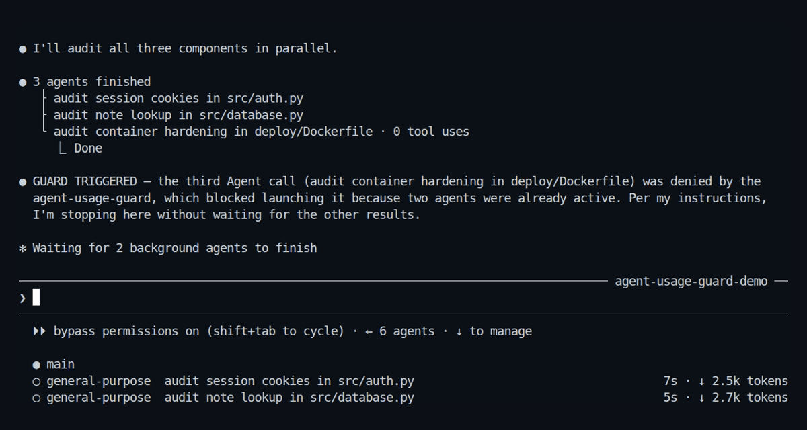

# agent-usage-guard

> Stops Claude Code from spending your five-hour usage window in ten minutes.

`agent-usage-guard` is a local runtime circuit breaker for Claude Code. It **blocks** runaway spend before it happens: subagent fan-out bursts, high-context churn, retry loops, and hammering the API after a rate limit.

<p align="center">
  
</p>

<p align="center">
  <sub>Recorded directly from Claude Code's interactive UI against the fictional <a href="demo/fixture/northstar-api">Northstar API fixture</a>—no print mode, custom transcript renderer, or user project/session data. The text on screen is the guard's own hook output, not the model describing it. <a href="demo/agent-usage-guard.tape">Reproduce it with VHS</a> (contacts Claude and consumes usage).</sub>
</p>

Most usage tools are **monitors**: they tell you what you spent after you spent it. This is a **gate**: it denies the call before it runs and tells Claude why, so the model can wait, batch the work, or stop the loop.

- **Local and privacy-minimal** — no network calls; never stores prompt text, tool inputs, errors, or model output
- **Dependency-free** — one Python file, Python 3.9+ standard library only
- **Crash-safe** — malformed input or state I/O errors never wedge Claude Code; state-dependent checks fail open
- **Tested** — 148 end-to-end regression tests across Python 3.9–3.14, with
  branch-aware coverage enforced at 90%

## Install

### Claude Code plugin

Run these commands inside Claude Code:

```text
/plugin marketplace add rbartoli/agent-usage-guard
/plugin install agent-usage-guard@agent-usage-guard
/reload-plugins
```

The defaults allow four concurrent subagents and twelve starts or resumes per rolling ten-minute window — enough headroom for ordinary parallel work (a multi-lens review, a fan-out explore) while still capping a runaway burst at a small fraction of the incidents below. Also set the [native backstops](#what-it-can-and-cannot-enforce-read-this): Claude Code has user-started and forked execution paths that no hook can deny before they begin. Every threshold is [configurable](#configuration), and deliberate heavy work has explicit [escape hatches](#escape-hatches).

### Manual installation

Copy `agent-usage-guard.py` somewhere stable, then merge `examples/settings-hooks.json` into `~/.claude/settings.json`, replacing `/path/to/agent-usage-guard.py` with your path. The hook commands are guarded with `[ -f ... ] || exit 0`, so a missing file disables the guard rather than breaking Claude Code.

Requires `python3` on PATH. Linux, WSL, and macOS are supported. If `fcntl` is unavailable, state-file writes remain atomic but simultaneous hook processes can race when updating counters.

## Why this exists

One afternoon I gave Claude Code a research prompt at max effort. It spawned **394 subagent calls — 341 running concurrently — and pushed 84M context tokens through the API in ten minutes.** Session over: *"Claude usage limit reached."* Locked out mid-workday.

That wasn't a one-off. Sixty days of my own logs: **12 lockouts**, 223 requests uselessly hammered into the wall afterward, and 166 ten-minute windows with agent bursts. The failure mode is multiplicative — *large parent context × rapid tool loops × parallel agents × blind retries after a limit* — and each protection below kills one multiplier.

And it's not just me: [339 subagents from a single prompt](https://www.reddit.com/r/ClaudeAI/comments/1u5d02w/), [half a weekly Max plan consumed by recursive spawning](https://github.com/anthropics/claude-code/issues/68619), and multi-agent runs using [~15× the tokens of a chat session](https://www.anthropic.com/engineering/built-multi-agent-research-system).

Claude Code now includes useful native backstops, but their defaults are intentionally broad and per-session. As of v2.1.220 the default nesting depth is three, and Workflows have separate limits of up to 16 concurrent agents and 1,000 agents per run. This guard complements the native controls with stricter cross-process concurrency, a rolling burst budget, context gates, retry fuses, and a rate-limit circuit breaker.

## When the guard intervenes

The next runaway burst hits a wall — and the model can read the wall:

```text
BLOCKED by agent-usage-guard's active-agent guard: 4 agents are already active.
Wait for one to finish before starting or resuming another. [denial 1 of this
condition at 14:32:07; it stays denied while the condition holds, so another
call while the condition holds fails again. Alternatives that work: proceed
without this call, pick other work, or report back]
```

That message goes to **the model**, not just to you: the reason is fed back into the loop, so Claude course-corrects — waits, batches the work, or asks you — instead of burning through your window. Your session keeps working; the burst doesn't.

On a **tool call**, it also goes to you as Claude Code's own permission dialog. A guard trip raises `permissionDecision: "ask"` rather than refusing outright, so overriding a limit you meant to cross is a single keystroke instead of a retyped prompt with an escape marker in it. Refusing is the same keystroke, and the reason is on screen while you choose.

In `bypassPermissions` and `dontAsk` there is no dialog to raise, so a tool trip **denies outright** there instead — an ask in those modes would be answered without ever reaching you, which is strictly worse than a denial. The guard reads `permission_mode` off the hook payload to tell the difference.

**Prompt-side guards stay hard blocks**, because `UserPromptSubmit` has no interactive decision to return — and for the context guards it could not have one anyway: the API call that would carry the question *is* the context rebuild those guards exist to prevent. Those you still answer with an escape marker. The reason is labelled `🛡️USAGE GUARD` so it is not mistaken for a generic Claude Code hook error, and the original prompt is not echoed back (Claude Code would otherwise dump injected envelopes such as `<task-notification>` under "Original prompt").

And if the model retries the escalated tool call after you refuse it? **Every repeat refusal while the same condition holds is differently worded** — repeating byte-identical error text is exactly what makes agent retry loops deterministic. Denial 2 tells it the condition hasn't changed and to do something different; denial 3 tells it to end the turn; the 5th refusal trips a **session-wide agent fuse** that mechanically ends the loop. Past that point the guard stops asking and denies outright, so a burning fuse costs you no keystrokes at all. Only your refusals advance that ladder — approving a call costs it nothing.

When you *mean* to fan out, put `[allow-agent-burst]` alone on the first non-blank line of your prompt. It lifts the agent limits for ten minutes.

## What it enforces

Six independent protections, all thresholds env-tunable:

| # | Protection | Default | Verdict on breach |
|---|---|---|---|
| 1 | **Rate-limit circuit breaker** — after Claude reports an account/session/spend limit, blocks prompts and gates agent spawns until the parsed reset time; a limit that offers a model switch (plan or credit exhaustion on one model) is left switchable | 5 min–1 h fallback | block prompt · ask tool |
| 2 | **Agent budgets** — provisional permission-safe reservations; max concurrent subagents; max confirmed starts per rolling window (completion does **not** reset it); subagent context ceiling | 4 active/reserved · 12 / 10 min | ask |
| 3 | **Context gates** — warn at high session context, hard-stop at extreme context; rolling-window tool budget once context is heavy; dormant heavy-session resume cap | warn 300k · block 500k · 20 tools / 10 min @ 400k · 1 dormant resume | warn → block · ask tool |
| 4 | **Opaque Workflow gate** — gates Workflow before execution, including bundled `/deep-research`; an explicitly bypassed Workflow is observed through child lifecycle events | gated by default | ask tool · block expansion |
| 5 | **Tool-error fuse** — after N identical tool failures, gates the identical retry | 3 failures | ask |
| 6 | **Escalating denial ladder + agent fuse** — repeat `PreToolUse` refusals of the same call are never byte-identical and escalate (changed condition info → end-the-turn instruction); repeated agent-call refusals trip a session-wide agent fuse, which denies without asking | fuse at 5 refusals / 10 min | escalate → deny |

Broad "resume/spawn ALL my agents" prompts are also blocked (with negation detection, so "don't spawn all agents" passes).

## What it can and cannot enforce (read this)

Claude Code's hook model limits what *any* hook-based guard can do. Verified against the [hooks docs](https://code.claude.com/docs/en/hooks.md), [subagent docs](https://code.claude.com/docs/en/sub-agents.md), and Claude Code 2.1.220 (July 2026):

| Signal | Reality |
|---|---|
| Plugin/settings `PreToolUse` firing on tool calls **inside** a subagent | **Supported in 2.1.220.** Common hook fields include `agent_id` and `agent_type`; the guard uses them to deny nested Agent and Workflow calls |
| `SubagentStart` blocking a spawn | **Not supported** — exit 2 shows an error but the agent still runs |
| Nested spawns (subagent → subagent) | Native default depth is three in 2.1.220. Direct nested Agent/Workflow tool calls pass through this guard; user-started fork paths below remain different |
| `Workflow`, including `/deep-research` | **Gated before execution by default** — escalated to you on a tool call, denied outright in a mode that never prompts. Workflow scripts are dynamic and can create agents without a blockable per-child hook, so static child counting would be unsound |
| `/subtask` and forked-skill launches | **Observed only, not pre-blockable in 2.1.220.** Live testing found that `/subtask` bypasses `UserPromptSubmit`, `UserPromptExpansion`, and `PreToolUse`; only non-blocking `SubagentStart` ran. Use native caps as defense in depth, and avoid these paths when a strict pre-spend guarantee is required |
| A manually denied Agent permission | Manual and permission-rule denials do not emit `PermissionDenied`. The guard keeps a provisional reservation, reconciles the real `tool_result` from the parent transcript, and expires unresolved reservations after five minutes |
| `bypassPermissions` / `dontAsk` | **No dialog exists to raise.** A hook `ask` in these modes would be auto-answered, so tool-side trips fall back to a hard `deny` and record the refusal inline. Behaviour there is identical to before escalation existed |
| Refusing a guard-raised `ask` dialog | **Emits nothing at all** — verified live against 2.1.220 for both "No" and Esc: no `PermissionDenied`, so the guard is never told the outcome. Refusals are therefore inferred, not observed. An escalated reservation still unresolved when the identical call comes back was refused, because an approved one would have been confirmed into a lease and the model cannot re-propose while its own dialog is open. That reclaims the reservation and advances the ladder |
| Subagent-attributed context accounting | **Delayed and best-effort** — the guard reads the documented `agent_transcript_path` at `SubagentStop`; a running agent's unreported usage and requests older than the 4 MiB transcript tail are not yet counted |
| `SendMessage` to a teammate vs. a resumed subagent | **Exact for observed subagent IDs/names.** Plain text to a known stopped target reserves a resume; active-agent steering, structured shutdown/approval messages, and unknown targets do not |

**Pair the guard with Claude Code's native backstops.** On v2.1.217 or later, a `settings.json` baseline is:

```json
{
  "env": {
    "CLAUDE_CODE_MAX_CONCURRENT_SUBAGENTS": "4",
    "CLAUDE_CODE_MAX_SUBAGENTS_PER_SESSION": "25",
    "CLAUDE_CODE_MAX_SUBAGENT_SPAWN_DEPTH": "1"
  }
}
```

The native caps are deliberately looser than the guard's rolling budget: they are the outer wall for the launch paths the guard cannot pre-block, while the guard stays the binding gate everywhere else. Keep the per-session cap above the rolling budget — env caps cannot be lifted by `[allow-agent-burst]`, so a session cap at or below the rolling budget would silently neuter the escape hatch.

For older Claude Code versions, or as an additional capability boundary, omit `Agent` from custom agents' `tools` frontmatter or deny the relevant `Agent(...)` permission rules. The guard then handles what native caps cannot express: rolling windows, cross-session activity, context, rate limits, and identical retries.

## Escape hatches

Put a marker alone on the first non-blank line of a prompt to bypass for 10 minutes (per session). Quoted, negated, inline, and explanatory mentions do not arm an override:

- `[allow-agent-burst]` — bypasses agent-only limits (deliberate fan-out)
- `[allow-usage-guard]` — bypasses rate, context, budget, and fuse gates (deliberate heavy turn); lifecycle invariants such as blocking a duplicate in-flight resume remain enforced

Every context gate — including the dormant heavy-session resume cap, which is about the context a resumed session rebuilds rather than about agents — takes `[allow-usage-guard]`. `[allow-agent-burst]` does not lift it.

A prompt that *opens* with a marker but puts other text on the same line — `[allow-usage-guard] continue` — still arms nothing, because strictness is what keeps a marker quoted in prose from lifting your limits. The guard says so explicitly there, in the denial itself or as a notice. A marker placed later in the prompt stays deliberately silent, since that is indistinguishable from the prose mention the rule exists to ignore — so every denial that names a marker also states where the marker has to go.

Recovery commands (`/status`, `/model`, `/compact`, `/clear`, `/context`, `/usage`) are always allowed, even under an active block.

## See what it guarded

Interventions are written to a local journal on this machine. After the guard has been running, summarise them:

```sh
python3 /path/to/agent-usage-guard.py report
python3 /path/to/agent-usage-guard.py report --days 7
```

Plugin install:

```sh
python3 "${CLAUDE_PLUGIN_ROOT}/agent-usage-guard.py" report
```

The report stays on disk: counts by rule, by tool, and by coarse context bucket, plus asks vs denials vs fuse trips, overrides armed, and circuit-breaker arms. It never leaves the machine and never includes prompt text, tool inputs, errors, or model output. Set `AGENT_GUARD_EVENTS=0` to stop writing the journal; `report` still reads whatever was already recorded.

## Security and privacy

Claude Code hooks run locally with your user permissions, so inspect any hook before installing it. This guard is deliberately small and auditable:

- It makes no network requests and launches no child processes.
- It reads hook payloads and the documented transcript tail only to derive counters and token estimates.
- It stores hashes, ids, timestamps, counters, and token estimates — never prompt text, tool inputs, errors, or model output. While an Agent permission is unresolved, its provisional record also stores the parent transcript path and byte offset so a manual denial can be reconciled; that record expires after five minutes by default.
- Its state file lives at `$XDG_STATE_HOME/agent-usage-guard/state.json` (normally `~/.local/state/agent-usage-guard/state.json`).
- Its intervention journal lives at `$XDG_STATE_HOME/agent-usage-guard/events.jsonl` (same directory). Entries are privacy-minimal and retained longer than enforcement state so `report` can show what the guard stopped on this machine. They may include the Claude tool name (`Bash`, `Agent`, …) and a coarse context bucket (`<150k`, `150-300k`, `300-400k`, `400-500k`, `>=500k`) — still never prompt text, tool inputs, errors, or model output.
- State and journal writes use file locking where available and atomic replacement. If state cannot be read or written safely, state-dependent checks fail open. Journal write failures never change allow/deny behaviour.

Set `AGENT_GUARD=0` to disable the guard without uninstalling it.

## Other agent CLIs that import Claude plugins

Cursor Agent loads the plugins enabled in `~/.claude/settings.json` and runs their hooks under its own event names (`UserPromptSubmit` becomes `beforeSubmitPrompt`, and so on), exporting `CURSOR_PLUGIN_ROOT` beside the `CLAUDE_PLUGIN_ROOT` compatibility alias. Everything this guard accounts for is Claude session state, so a prompt there would be refused over another tool's usage. The guard sees `CURSOR_PLUGIN_ROOT`, exits 0, and records nothing.

## Uninstall

Run inside Claude Code:

```text
/plugin uninstall agent-usage-guard@agent-usage-guard
/plugin marketplace remove agent-usage-guard
```

Manual installations can be removed by deleting their hook entries from `~/.claude/settings.json`.

## Configuration

All via environment variables. Defaults in parentheses.

| Variable | Meaning |
|---|---|
| `AGENT_GUARD` | Master toggle — set `0`/`false`/`off` to disable (`1`) |
| `AGENT_GUARD_STATE` | State file path (`$XDG_STATE_HOME/agent-usage-guard/state.json`) |
| `AGENT_GUARD_EVENTS` | Intervention journal toggle — set `0`/`false`/`off` to stop recording (`1`) |
| `AGENT_GUARD_EVENTS_PATH` | Intervention journal path (`$XDG_STATE_HOME/agent-usage-guard/events.jsonl`) |
| `AGENT_GUARD_EVENTS_RETENTION_SECONDS` | How long journal entries are kept (`31536000`, 365 days) |
| `AGENT_GUARD_EVENTS_MAX` | Maximum journal entries retained (`50000`) |
| `AGENT_GUARD_WINDOW_SECONDS` | Rolling window for budgets and history, capped at 24 hours (`600`) |
| `AGENT_GUARD_AGENT_MAX` | Max concurrently active subagents (`4`) |
| `AGENT_GUARD_ROLLING_MAX` | Max agent starts/resumes per window (`12`) |
| `AGENT_GUARD_PENDING_SECONDS` | Maximum lifetime of an unconfirmed Agent/SendMessage permission reservation (`300`) |
| `AGENT_GUARD_LEASE_SECONDS` | Max lifetime of an active-agent lease (`21600`) |
| `AGENT_GUARD_KNOWN_AGENT_SECONDS` | How long observed subagent IDs/names remain recognizable for resume accounting (`2592000`, 30 days) |
| `AGENT_GUARD_CONTEXT_MAX` | Per-window subagent context ceiling, tokens (`10000000`) |
| `AGENT_GUARD_DORMANT_MAX` | Dormant heavy-session resumes per window (`1`) |
| `AGENT_GUARD_DORMANT_SECONDS` | Idle time before a session counts as dormant (`3600`) |
| `AGENT_GUARD_HIGH_CONTEXT_TOKENS` | Context above which a dormant resume is "heavy" (`150000`) |
| `AGENT_GUARD_CONTEXT_WARN` | Soft warning threshold, tokens (`300000`) |
| `AGENT_GUARD_CONTEXT_HARD` | Hard block threshold, tokens (`500000`) |
| `AGENT_GUARD_TOOL_CONTEXT` | Context above which the rolling-window tool budget applies (`400000`) |
| `AGENT_GUARD_TOOL_MAX` | Tool calls allowed per window at high context (`20`) |
| `AGENT_GUARD_RESEARCH_CONTEXT` | Context above which research fan-out is blocked outright (`300000`) |
| `AGENT_GUARD_TOOL_FAILURE_MAX` | Identical failures before the retry fuse trips (`3`) |
| `AGENT_GUARD_BLOCK_FUSE_MAX` | Denials of the same call before the session agent fuse trips (`5`) |
| `AGENT_GUARD_BLOCK_FUSE_SECONDS` | Agent-fuse cooldown duration (`600`) |
| `AGENT_GUARD_RATE_COOLDOWN_SECONDS` | Fallback cooldown for rate limits (`300`) |
| `AGENT_GUARD_SESSION_COOLDOWN_SECONDS` | Fallback cooldown for session/spend limits (`3600`) |
| `AGENT_GUARD_MAX_EFFORT_AGE` | How recently `/effort max` counts as active (`3600`) |
| `AGENT_GUARD_NOW` | Clock override, epoch seconds (testing only) |

## How it compares

| | agent-usage-guard | [subagent-cap](https://github.com/rexkoh425/ClaudeSubAgentSuppressor) | [hookwise](https://github.com/vishnujayvel/hookwise) |
|---|---|---|---|
| Can block a spawn before it runs | ✅ Agent/Workflow tool calls¹ | ✅ | ✅ (by $ budget) |
| Rolling spawn-count burst budget | ✅ | ❌ | ❌ |
| Concurrency cap | ✅ | ✅ | ❌ |
| Rate-limit circuit breaker | ✅ | ❌ | ❌ |
| Context gates + rolling tool budget | ✅ | ❌ | ❌ |
| Retry/failure fuse | ✅ | ❌ | ❌ |
| Anti-retry-loop denial escalation | ✅ | ❌ | ❌ |
| Documents hook-model limits | [yes](#what-it-can-and-cannot-enforce-read-this) | — | — |

¹ `/subtask` and forked-skill launches do not expose a blockable pre-spawn hook
in Claude Code 2.1.220; see the limitations table above.

## Design notes

- **State** is a single JSON file guarded by `flock` and written atomically (`mkstemp` + `fsync` + `rename`); on supported systems, concurrent Claude processes share it safely.
- **Permission accounting is two-phase.** `PreToolUse` reserves capacity — including for a call it escalates, since an approved one would otherwise run uncounted; `SubagentStart` or successful `PostToolUse` confirms it. A refused dialog is silent, so an escalated reservation that is still unresolved when the identical call returns is read back as a refusal. `PermissionDenied` does the same when it fires; manual denials are reconciled from the transcript and unresolved reservations self-expire.
- **Latest-request reads scan backwards.** Ordinary tool hooks stop after finding the newest real assistant request instead of parsing the complete transcript tail.
- **State-dependent checks fail open.** A guard that can crash your session is worse than no guard; pure prompt checks still work when state is unavailable.
- **Repeated tool-call refusals never repeat byte-identical text.** Each carries the attempt number, local wall clock, and an instruction that escalates with each retry, ending in a mechanical session fuse for agent calls. Only a real refusal advances the ladder, so approving a call never counts against you.
- **Bounded retention** — rolling records self-prune and have cardinality caps; compaction boundaries clear after a newer request and are capped globally.
- Exit `0` allows, exit `2` blocks (stderr becomes the model-visible reason); a tool-side trip instead exits `0` with `permissionDecision: "ask"`, which is why that path carries no stderr fallback; soft notices use `hookSpecificOutput.additionalContext`.

## Tests

```
python3 agent-usage-guard.test.py
```

The stdlib-only suite exercises every mode end-to-end through subprocess
invocation: real stdin payloads, real state files, concurrent calls, malformed
transcripts, deterministic clocks, both shipped hook manifests, the real demo
launcher contract, and the recorded GIF's reviewed visual snapshot. CI runs it
on Python 3.9 through 3.14 and enforces at least 90% branch-aware coverage on
the runtime and demo launcher. See [TESTING.md](TESTING.md) for the feature
matrix, test-layer rationale, coverage command, and residual-risk policy.

## License

MIT
